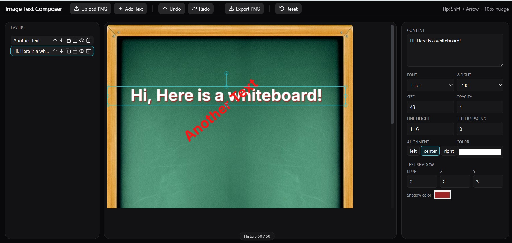

# Image Text Composer (Next.js + TypeScript + Fabric.js)

Desktop-only single-page PNG editor that lets you upload an image and overlay fully customizable text. Built for the Adomate coding assignment.



## ✨ Features (Core)
- Upload PNG as background; canvas auto-sizes to the image and keeps original dimensions on export.
- Add multiple text layers; edit font family (Google Fonts), weight, size, color, opacity, alignment, multi-line text.
- Transform text layers: drag, resize via handles, rotate.
- Layer management: reorder, duplicate, hide/show, lock/unlock, delete.
- Canvas UX: snap-to center guidelines (H/V), arrow-key nudge (±1px, Shift = ±10px).
- Undo/Redo (up to 50 steps) with visible indicator.
- Autosave to `localStorage`; one-click **Reset**.
- Export PNG at original image dimensions (no scaling).

## 🧩 Bonus Implemented
- Line-height & letter-spacing controls.
- Text shadow (color, blur, X/Y offset).
- Duplicate, lock/unlock layers.
- Basic keyboard shortcuts: ⌘/Ctrl+Z / ⇧+⌘/Ctrl+Z, Delete/Backspace, ⌘/Ctrl+D.

## 🚀 Getting Started
```bash
npm i   # or npm i / yarn
npm dev # http://localhost:3000
npm test # run unit tests
```

> Optional: To list all Google Fonts, set an API key:
>
> 1. Create `.env.local` with `GOOGLE_FONTS_API_KEY=YOUR_KEY`
> 2. Restart dev server.
>
> Without a key, a high-quality fallback set (Inter, Roboto, Open Sans, Lato, Montserrat) is used.

## 🏗️ Architecture
- **Next.js App Router** (client-only editor UI, SSR disabled for the canvas component)
- **Fabric.js** for canvas primitives, transforms, selection, and PNG export
- **Zustand** for editor state (canvas ref, background, layers, history)
- **History snapshots**: `fabric.Canvas.toJSON()` with custom props, size-limited ring buffer (50)
- **Autosave**: background DataURL + latest snapshot in `localStorage`
- **Fonts**: `/api/fonts` proxies Google Fonts API; client injects CSS2 URLs on-demand and awaits `document.fonts` before render/export

```
app/
  api/fonts/route.ts     # server route to list fonts (with cache)
  page.tsx, layout.tsx   # app shell (desktop gate)
components/
  Editor.tsx             # layout and plumbing
  panels/                # Topbar, Layers, RightPanel, History indicator
  fabric/                # type alias for Canvas
lib/                     # canvas utils, history, storage, fonts, color
store/                   # zustand editor store
```

## 🧪 Tests
- **lib/color.test.ts** covers `rgbToHex()` for rgb/rgba/#hex/invalid inputs.
- **lib/storage.test.ts** covers autosave helpers with a mocked `localStorage`.

Run: `npm test` or `pm run test`.

## 🧠 Design & UX Choices
- **Desktop-only**: editor is intentionally gated when `<1024px`.
- **Snap-to-center**: simple, fast guideline rendering during `object:moving`.
- **Nudge UX**: Arrow keys (±1px), with Shift for ±10px; matches common editors.
- **Safe export**: temporarily resets viewport transform for a pixel-perfect PNG.

## 🛡️ Known Limitations
- **Autosave size**: very large PNGs can exceed `localStorage` quota. The app catches this and continues without autosave.
- **Layer list**: reorder via up/down buttons (no drag handle to keep deps light).
- **Fonts list**: requires a free Google API key for the full directory; otherwise uses a popular subset.

## 📦 Deploying
- Click **Deploy to Vercel**, set `GOOGLE_FONTS_API_KEY` env if desired.
- No paid APIs are used; the Google Fonts key is free.

## 📚 Tech Choices & Trade‑offs
- **Fabric.js** over Konva: text-editing UX is simpler, built-in textboxes, shadows, and serialization made history/autosave/export straightforward.
- **Zustand** for minimal global state without boilerplate; fine-grained selectors keep renders small.
- **No drag-and-drop for layers** to avoid heavy deps and focus on editor performance; up/down buttons cover the requirement.
